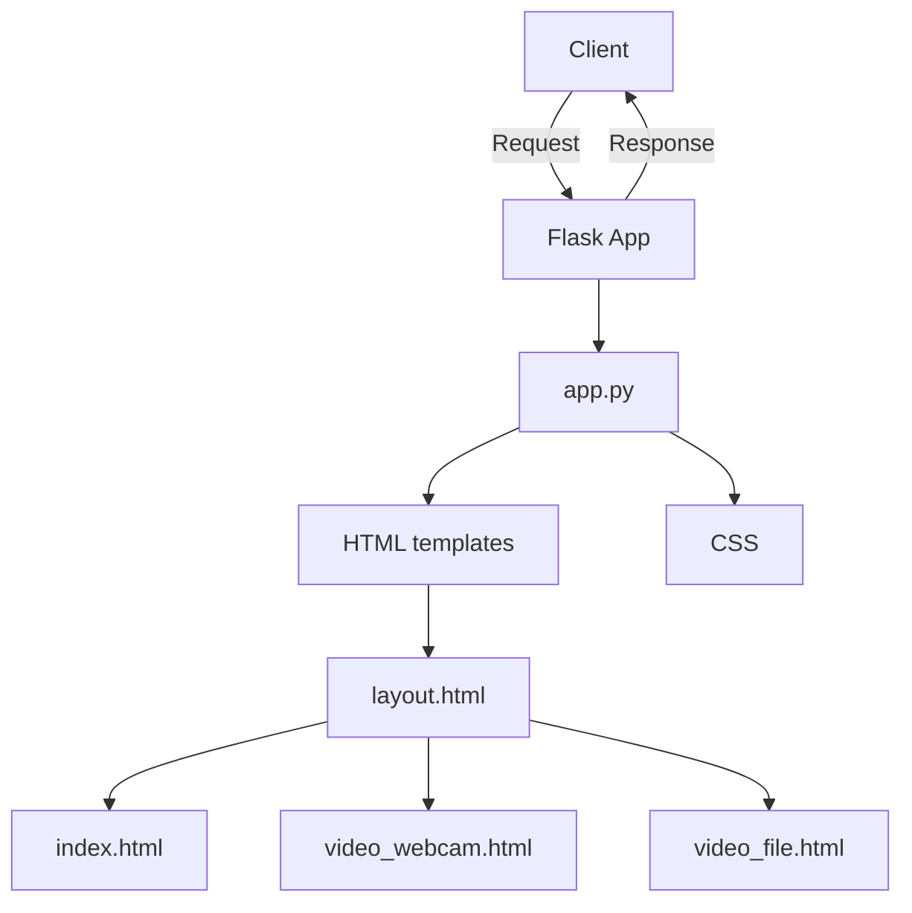

# Mon application Flask

Mon application Flask est une application web construite avec le framework Flask en Python. Elle utilise OpenCV pour afficher des flux vidéo à partir d'une webcam ou d'un fichier vidéo et affiche l'état des LEDs qui peuvent être activées/désactivées via l'interface utilisateur.

Vidéo démo : [Vidéo YT Démo](https://youtu.be/6myBoZKQD5I)

## Structure de l'application

L'application est composée des fichiers suivants :

- `app.py` : C'est le point d'entrée de l'application Flask. Il définit les routes de l'application et le traitement nécessaire pour chaque route.
- `templates/` : Ce dossier contient les modèles HTML utilisés par l'application.
  - `index.html` : La page d'accueil de l'application.
  - `video_webcam.html` : La page qui affiche le flux vidéo de la webcam.
  - `video_file.html` : La page qui affiche le flux vidéo d'un fichier vidéo.
  - `layout.html` : Le modèle de base utilisé par les autres modèles. Il définit la structure de base des pages et inclut des liens vers les fichiers CSS et JavaScript nécessaires.
- `static/css/style.css` : La feuille de style CSS pour l'application.

## Interactions Réseaux

L'application interagit avec le navigateur du client via des requêtes HTTP. Voici une description de chaque route et de son fonctionnement :

- `/` : Affiche la page d'accueil.
- `/video_webcam` : Affiche la page de flux vidéo de la webcam.
- `/video_file` : Affiche la page de flux vidéo du fichier.
- `/video_stream_webcam` et `/video_stream_file` : Ces routes renvoient un flux vidéo multipart, qui est utilisé pour afficher le flux vidéo sur les pages de flux vidéo.
- `/toggle_led` : Cette route accepte une requête POST avec l'ID d'une LED et inverse son état.
- `/get_temperature_values` : Renvoie une liste des dernières valeurs de température.
- `/get_temperature` : Génère une nouvelle valeur de température aléatoire et la renvoie.

L'application utilise également AJAX pour faire des requêtes à ces routes sans avoir à recharger la page. C'est utilisé pour mettre à jour l'état des LEDs et pour récupérer les nouvelles valeurs de température.
